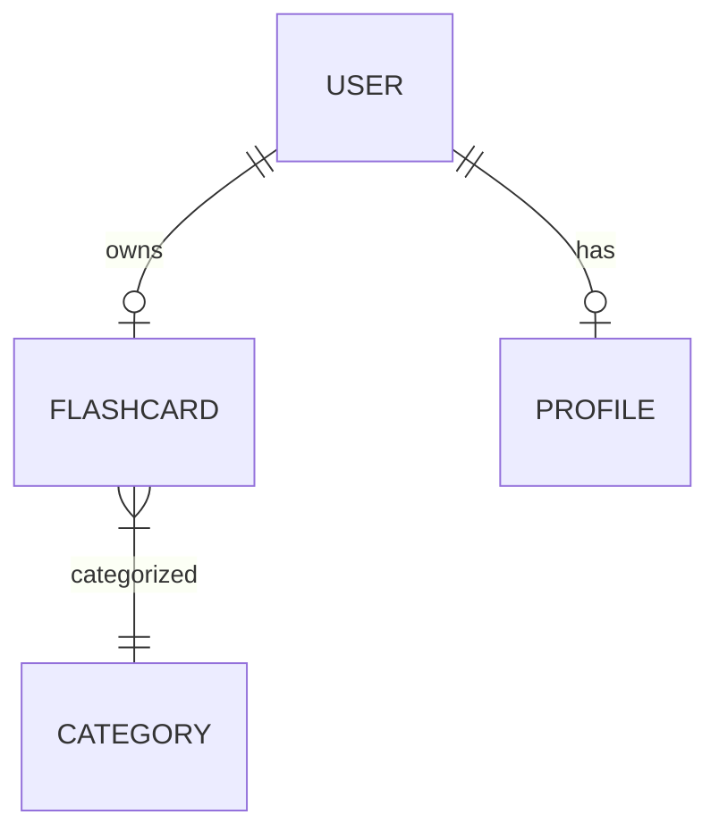
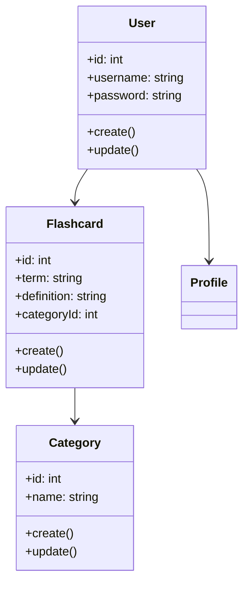

# Specification Document

## Functional Requirements
1. User registration and login
2. CRUD (Create, Read, Update, Delete) functionality for flashcards
3. Ability to categorize flashcards
4. Search functionality to find flashcards
5. User profile management

## Non-Functional Requirements
1. Performance: The application should load within 3 seconds.
2. Security: User data must be encrypted.
3. Usability: Interface should be intuitive and user-friendly.
4. Reliability: System should maintain 99.9% uptime.

## Entity-Relationship Diagram (Mermaid Format)

## UML Class Diagram

## Development Plan
1. **Week 1-2**: Requirement gathering and analysis.
2. **Week 3-4**: UI/UX design and prototypes.
3. **Week 5-8**: Development of core functionalities.
4. **Week 9-10**: Testing and bug fixing.
5. **Week 11**: Deployment and monitoring.